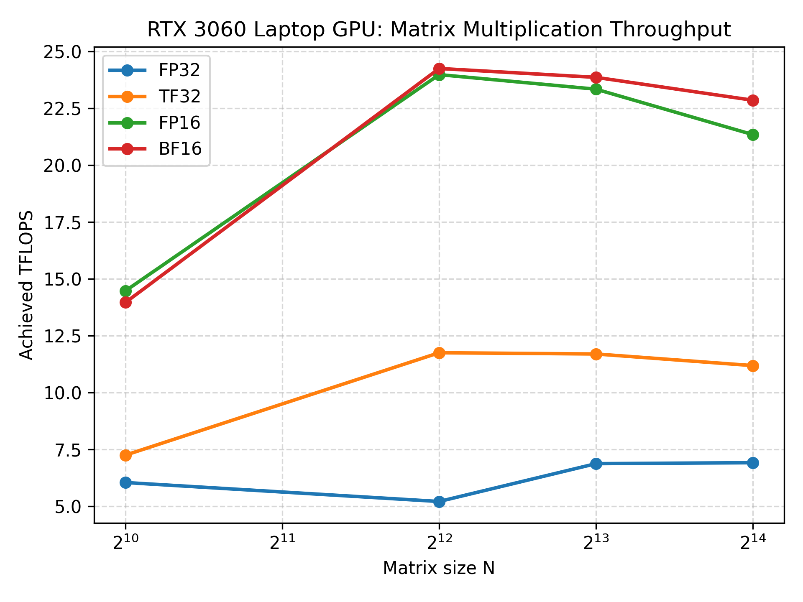
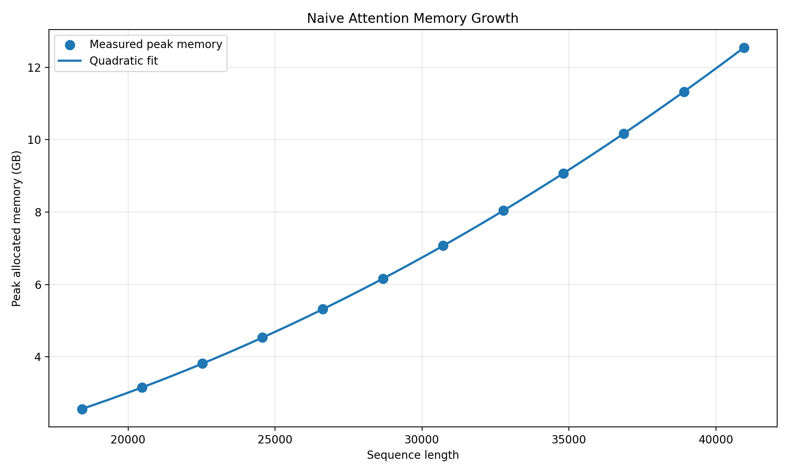
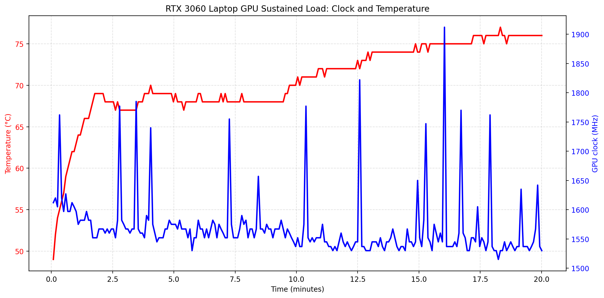

# GPU Kernel and Compiler Performance Lab

A GPU systems project focused on understanding how machine learning workloads are transformed into efficient GPU execution.

The project studies numerical precision, matrix multiplication, memory bandwidth, attention mechanisms, operator fusion, custom kernels, and compiler assisted execution using PyTorch and CUDA enabled NVIDIA hardware.

## Project Overview

Modern AI workloads are constrained by two major factors:

1. How quickly the GPU performs mathematical operations.
2. How quickly the GPU moves data through memory.
# GPU Kernel and Compiler Performance Lab

A reproducible GPU systems benchmarking project focused on numerical precision, matrix multiplication, memory bandwidth, attention memory behavior, fused kernels, and sustained GPU performance.

The experiments were performed on an NVIDIA GeForce RTX 3060 Laptop GPU using PyTorch and CUDA.

## Project Objectives

This project studies how machine learning operations behave on real GPU hardware by measuring:

- Dense matrix multiplication throughput
- FP32, TF32, FP16, and BF16 performance
- Theoretical versus achieved TFLOPS
- Memory-bound and compute-bound workloads
- Effective memory bandwidth
- Arithmetic intensity
- Naive attention memory growth
- Fused attention performance
- Out-of-memory boundaries
- Sustained GPU throughput
- Power and thermal behavior
- GPU utilization and clock behavior

The results demonstrate how numerical precision, memory movement, intermediate tensor materialization, matrix size, kernel selection, and power limits affect AI workload performance.

## Hardware and Software

| Property | Measurement |
|---|---|
| GPU | NVIDIA GeForce RTX 3060 Laptop GPU |
| Architecture | NVIDIA Ampere |
| VRAM | 6 GB |
| GPU UUID | `GPU-20606811-3bb2-e6b5-ec74-b477d9c1d1d8` |
| Driver version | 610.88 |
| PyTorch | 2.6.0+cu124 |
| CUDA runtime | 12.4 |
| Tensor Cores | 3rd-generation Tensor Cores |
| BF16 support | Available |
| Default power limit | 80 W |
| Maximum reported power limit | 115 W |

All measurements in Parts B–E were collected from the GPU identified by this UUID.

Hardware specifications were cross-checked against the [NVIDIA GeForce RTX 30 Series Laptop GPU specifications](https://www.nvidia.com/en-us/geforce/laptops/compare/30-series.md).

The complete hardware report is stored in `nvidia-smi-q.txt`.

## Repository Structure

The repository is organized into the following directories:

- `Scripts/`: Benchmarking and plotting scripts
- `figures/`: Generated benchmark figures
- `results/`: CSV results, summaries, and experiment logs
- `logs/`: Sustained-load telemetry logs
- `nvidia-smi-q.txt`: Complete GPU hardware report
- `README.md`: Project documentation

Important scripts include:

- `Scripts/matmul_benchmark.py`
- `Scripts/add_peak_percentages.py`
- `Scripts/plot_tflops.py`
- `Scripts/fp8_check.py`
- `Scripts/part_c_benchmark.py`
- `Scripts/part_c_bandwidth_precisions.py`
- `Scripts/naive_attention.py`
- `Scripts/naive_boundary.py`
- `Scripts/fused_attention.py`
- `Scripts/plot_memory.py`
- `Scripts/part_e_thermal_load.py`
- `Scripts/plot_part_e.py`

## Part B: Precision and Achieved Throughput

Dense square matrix multiplication was benchmarked using FP32, TF32, FP16, and BF16.

The tested matrix sizes were:

- 1024 × 1024
- 4096 × 4096
- 8192 × 8192
- 16384 × 16384

The benchmark used three warm-up repetitions before timing.

Timed repetitions were selected according to matrix size:

| Matrix size | Timed repetitions |
|---:|---:|
| 1024 × 1024 | 20 |
| 4096 × 4096 | 10 |
| 8192 × 8192 | 3 |
| 16384 × 16384 | 1 |

For square matrix multiplication, the approximate operation count is:

`FLOPs = 2 × N³`

Achieved throughput was calculated using:

`TFLOPS = FLOPs / execution time / 10¹²`

### Achieved TFLOPS

| Precision | N = 1024 | N = 4096 | N = 8192 | N = 16384 |
|---|---:|---:|---:|---:|
| FP32 | 6.05 | 5.21 | 6.88 | 6.92 |
| TF32 | 7.25 | 11.75 | 11.70 | 11.19 |
| FP16 | 14.47 | 23.98 | 23.34 | 21.34 |
| BF16 | 13.96 | 24.25 | 23.86 | 22.85 |

### Percentage of Theoretical Peak

| Precision | Theoretical peak | N = 1024 | N = 4096 | N = 8192 | N = 16384 |
|---|---:|---:|---:|---:|---:|
| FP32 | 13.08 TFLOPS | 46.22% | 39.85% | 52.56% | 52.88% |
| TF32 | 26.16 TFLOPS | 27.72% | 44.92% | 44.71% | 42.76% |
| FP16 | 52.32 TFLOPS | 27.66% | 45.83% | 44.61% | 40.79% |
| BF16 | 52.32 TFLOPS | 26.69% | 46.35% | 45.60% | 43.68% |

### Precision Observations

The highest measured BF16 throughput was:

- Achieved throughput: 24.25 TFLOPS
- Matrix size: 4096 × 4096
- Percentage of theoretical peak: 46.35%

At N = 4096, the measured results were:

| Precision | Achieved throughput |
|---|---:|
| FP32 | 5.21 TFLOPS |
| TF32 | 11.75 TFLOPS |
| FP16 | 23.98 TFLOPS |
| BF16 | 24.25 TFLOPS |

BF16 achieved approximately 4.65× the FP32 throughput at N = 4096.

### Scaling Behavior

The curves approach their highest measured performance at larger matrix sizes because larger matrices provide more parallel work for the GPU.

Approximate plateau points were:

| Precision | Approximate plateau |
|---|---:|
| FP32 | N = 8192 |
| TF32 | N = 4096 |
| FP16 | N = 4096 |
| BF16 | N = 4096 |

Small matrices do not fully occupy the GPU because fixed costs such as kernel launch overhead, scheduling, and insufficient parallel work become significant relative to the computation.



### FP8 Result

FP8 was tested separately.

The RTX 3060 software stack did not successfully execute the FP8 matrix multiplication test. PyTorch raised the following error:

`RuntimeError: normal_kernel_cuda not implemented for 'Float8_e4m3fn'`

This was recorded as a tooling and hardware-support limitation rather than treated as a missing measurement.

The complete result is stored in `results/fp8_check.txt`.

## Part C: Memory-Bound and Compute-Bound Workloads

Two different workload types were measured:

1. A large elementwise vector addition representing a memory-bound workload.
2. A large square matrix multiplication representing a compute-bound workload.

### Memory-Bound Vector Addition

The vector addition used 67,108,864 FP32 elements.

Each elementwise addition reads two values and writes one result:

`Bytes per element = 3 × 4 = 12 bytes`

The benchmark used:

- 5 warm-up repetitions
- 20 timed repetitions

| Measurement | Result |
|---|---:|
| Elements | 67,108,864 |
| Average time | 0.002550 seconds |
| Effective bandwidth | 315.77 GB/s |
| Arithmetic intensity | 0.0833 FLOPs/byte |
| Approximate percentage of 336 GB/s reference bandwidth | 93.98% |

The very low arithmetic intensity means that the operation performs little computation per byte moved. Its performance is therefore primarily limited by memory bandwidth.

### Compute-Bound Matrix Multiplication

The compute-bound workload used FP32 matrix multiplication with N = 4096.

The benchmark used:

- 3 warm-up repetitions
- 10 timed repetitions

| Measurement | Result |
|---|---:|
| Matrix size | 4096 × 4096 |
| Average time | 0.026217 seconds |
| Achieved throughput | 5.24 TFLOPS |
| Arithmetic intensity | 682.67 FLOPs/byte |

The high arithmetic intensity means that the operation performs a large amount of computation relative to the amount of data transferred. This makes it primarily compute-bound.

### Bandwidth Across Storage Precisions

The vector addition was also measured with FP32, FP16, and BF16 storage.

| Precision | Bytes per value | Effective bandwidth | Arithmetic intensity |
|---|---:|---:|---:|
| FP32 | 4 | 315.59 GB/s | 0.0833 FLOPs/byte |
| FP16 | 2 | 313.17 GB/s | 0.1667 FLOPs/byte |
| BF16 | 2 | 312.67 GB/s | 0.1667 FLOPs/byte |

Changing precision reduced the amount of data transferred per element, but the measured bandwidth remained approximately 313–316 GB/s. The limiting factor was the memory system rather than floating-point arithmetic.

## Part D: The Cost of Attention

Scaled dot-product attention was implemented as:

`Attention(Q, K, V) = softmax(QKᵀ / √d) V`

The naive implementation explicitly materialized:

1. The sequence-by-sequence score matrix.
2. The sequence-by-sequence softmax matrix.

The attention configuration was:

| Parameter | Value |
|---|---:|
| Batch size | 1 |
| Number of heads | 1 |
| Head dimension | 64 |
| Naive data type | FP32 |
| Fused comparison data type | FP16 |

The tensors used the shape:

`[batch size, number of heads, sequence length, head dimension]`

### Naive Attention Coarse Sweep

| Sequence length | Average latency | Peak allocated memory |
|---:|---:|---:|
| 512 | 0.333 ms | 0.010 GB |
| 1024 | 0.232 ms | 0.017 GB |
| 2048 | 0.545 ms | 0.041 GB |
| 4096 | 1.795 ms | 0.137 GB |
| 8192 | 6.698 ms | 0.516 GB |
| 16384 | 28.990 ms | 2.024 GB |



### Naive Attention OOM Boundary

The boundary search produced:

| Boundary result | Sequence length |
|---|---:|
| Largest tested success | 40,960 |
| Smallest tested failure | 43,008 |

At sequence length 43,008, PyTorch reported an out-of-memory error on the 6 GB GPU.

The experiment does not claim an exact single-token boundary. It reports the largest successful tested length and the smallest failed tested length.

### Quadratic Memory Fit

The measured naive-attention memory curve was fitted using a quadratic model.

| Fit measurement | Result |
|---|---:|
| Quadratic coefficient | 7.4665 × 10⁻⁹ GB/token² |
| Equivalent coefficient | 8.0171 bytes/token² |
| Intercept | 0.021607 GB |
| R-squared | 1.000000 |

The approximate 8 bytes/token² coefficient is consistent with two materialized FP32 sequence-by-sequence matrices:

- Score matrix: approximately 4 bytes per matrix element
- Softmax matrix: approximately 4 bytes per matrix element
- Total: approximately 8 bytes per sequence-pair element

This confirms the expected quadratic memory growth from the measured data.

## Fused Attention

The fused implementation used PyTorch scaled dot-product attention with the Flash Attention or memory-efficient backend forced and the ordinary math fallback disabled.

The fused kernel avoids explicitly materializing the complete score and softmax matrices in global memory. It computes attention in tiles, keeps intermediate values in faster on-chip memory where possible, and writes the final output without storing all sequence-pair intermediates.

This reduces peak memory usage and global memory traffic.

### Naive versus Fused Attention

The following comparison used FP16, batch size 1, one head, and head dimension 64.

| Sequence length | Naive latency | Fused latency | Speedup | Naive memory | Fused memory |
|---:|---:|---:|---:|---:|---:|
| 512 | 0.281 ms | 0.136 ms | 2.06× | 0.009 GB | 0.008 GB |
| 1024 | 0.138 ms | 0.082 ms | 1.68× | 0.012 GB | 0.008 GB |
| 2048 | 0.389 ms | 0.195 ms | 1.99× | 0.025 GB | 0.009 GB |
| 4096 | 0.987 ms | 0.492 ms | 2.01× | 0.072 GB | 0.010 GB |
| 8192 | 3.287 ms | 1.529 ms | 2.15× | 0.262 GB | 0.012 GB |
| 16384 | 13.230 ms | 4.806 ms | 2.75× | 1.016 GB | 0.016 GB |

At sequence length 16,384:

- Fused attention was approximately 2.75× faster.
- Naive peak memory was approximately 1.016 GB.
- Fused peak workspace memory was approximately 0.016 GB.
- The fused implementation reduced measured additional memory by approximately 98.45%.

The fused memory values represent additional workspace measured after the Q, K, and V input tensors had already been allocated.

### Fused Attention Boundary

The fused attention implementation successfully ran through the largest tested sequence length:

`163,840 tokens`

No fused-attention out-of-memory failure was observed within the tested range.

Therefore, the result is reported as:

`No fused-attention OOM observed through 163,840 tested tokens`

This is a lower bound, not an exact OOM boundary.

## Part E: Sustained Load and Thermal Behavior

A sustained FP16 matrix multiplication workload was run for approximately 20 minutes.

The workload repeatedly executed:

`4096 × 4096 FP16 matrix multiplication`

GPU metrics were collected approximately every 5 seconds using `nvidia-smi`.

The recorded metrics were:

- GPU clock
- Memory clock
- Temperature
- Power draw
- GPU utilization
- GPU memory usage
- Achieved throughput

| Measurement | Result |
|---|---:|
| Duration | 1,200.58 seconds |
| Number of samples | 237 |
| Initial peak throughput | 22.76 TFLOPS |
| Final five-minute average | 21.47 TFLOPS |
| Steady-state as percentage of peak | 94.33% |
| Throughput decrease | 5.67% |
| Initial temperature | 49°C |
| Maximum temperature | 77°C |
| Average GPU utilization | 96.26% |
| Maximum power draw | Approximately 80 W |
| Memory clock | 7001 MHz |

The steady-state percentage was calculated as:

`Final five-minute throughput / initial peak throughput × 100`

`21.47 / 22.76 × 100 = 94.33%`



### Thermal Interpretation

The GPU reached its approximately 80 W power ceiling almost immediately, by approximately 10 seconds into the run.

The temperature increased from 49°C to approximately 77°C. However, there was no abrupt performance collapse and the maximum temperature remained below the observed thermal-throttling range.

The data therefore indicates power-limited clock management rather than clear temperature-based throttling.

Throughput gradually settled from approximately 22.76 TFLOPS to approximately 21.47 TFLOPS during the sustained workload.

## Summary of Key Measurements

| Measurement | Result | Notes |
|---|---:|---|
| Peak achieved BF16 throughput | 24.25 TFLOPS | N = 4096 |
| BF16 percentage of theoretical peak | 46.35% | RTX 3060 Laptop GPU |
| Effective FP32 vector-add bandwidth | 315.77 GB/s | Approximately 93.98% of 336 GB/s reference |
| Naive attention largest success | 40,960 tokens | FP32, batch size 1, head dimension 64 |
| Naive attention smallest failure | 43,008 tokens | FP32, batch size 1, head dimension 64 |
| Fused attention largest tested success | 163,840 tokens | No OOM observed |
| Fused attention speedup at N = 16384 | 2.75× | FP16 |
| Steady-state / peak throughput | 94.33% | 20-minute sustained load |
| Power event | 80 W power ceiling | Reached by approximately 10 seconds |
| Maximum observed temperature | 77°C | No clear thermal throttling |

Every result is traceable to the GPU UUID:

`GPU-20606811-3bb2-e6b5-ec74-b477d9c1d1d8`

## Reproducibility

Run the following commands from the repository root:

`python .\Scripts\matmul_benchmark.py`

`python .\Scripts\part_c_benchmark.py`

`python .\Scripts\part_c_bandwidth_precisions.py`

`python .\Scripts\naive_attention.py`

`python .\Scripts\naive_boundary.py`

`python .\Scripts\fused_attention.py`

`python .\Scripts\part_e_thermal_load.py`

`python .\Scripts\plot_part_e.py`

All benchmark scripts perform GPU warm-up before timing and record the relevant repetition count in the output files.

## Compiler and AI Systems Relevance

The measurements provide practical experience with:

- Mapping high-level tensor operations to GPU kernels
- Selecting numerical formats for throughput and memory efficiency
- Understanding Tensor Core workloads
- Measuring achieved rather than theoretical performance
- Distinguishing compute-bound and memory-bound operations
- Reasoning about arithmetic intensity
- Understanding quadratic attention memory growth
- Reducing intermediate tensor materialization
- Comparing naive and fused attention execution
- Measuring kernel and memory-system effects
- Understanding workload scaling
- Investigating power-limited sustained performance
- Reproducing results with hardware provenance

The project focuses on measured GPU execution behavior rather than only reporting hardware specifications.

## Limitations

- All results come from one NVIDIA GeForce RTX 3060 Laptop GPU.
- Laptop GPU power limits and cooling behavior depend on the specific chassis and environment.
- The fused-attention OOM boundary was not reached within the tested range.
- FP8 matrix multiplication was not supported by the tested PyTorch and CUDA software stack.
- The reported theoretical peaks are reference values and do not represent guaranteed application-level performance.
- A separate compiler-assisted eager-versus-compiled benchmark was not included in the measured Parts B–E results.

## Measurement Files

The raw measurement files include:

- `matmul_results.csv`
- `matmul_results_with_percentages.csv`
- `part_c_results.csv`
- `part_c_bandwidth_precisions.csv`
- `part_d_naive_attention.csv`
- `part_d_naive_boundary.csv`
- `part_d_fused_forced_comparison.csv`
- `part_d_fused_boundary.csv`
- `part_e_thermal_log.csv`
- `fp8_check.txt`
- `nvidia-smi-q.txt`

These files preserve the measured values, repetition counts, hardware UUID, statuses, and error messages used in the analysis.
This project evaluates both limitations through reproducible experiments on an NVIDIA GeForce RTX 3060 Laptop GPU. It connects high level machine learning operations with the lower level execution behavior that determines GPU performance.

The work is motivated by AI compiler and machine learning systems engineering, where compiler transformations, kernel implementations, memory reuse, numerical precision, and hardware utilization directly affect the speed of training and inference workloads.

## Objectives

- Measure GPU throughput across FP32, TF32, FP16, and BF16 precision.
- Compare achieved throughput with theoretical hardware limits.
- Analyze how matrix size affects GPU utilization.
- Identify compute bound and memory bound workloads.
- Measure the quadratic memory cost of naive attention.
- Compare naive attention with fused or memory efficient attention.
- Analyze operator fusion and compiler assisted execution.
- Measure GPU behavior during sustained workloads.
- Preserve hardware provenance for every measurement.
- Produce reproducible benchmark results, logs, and figures.

## Hardware and Software

- GPU: NVIDIA GeForce RTX 3060 Laptop GPU
- Architecture: NVIDIA Ampere
- VRAM: 6 GB
- GPU UUID: `GPU-20606811-3bb2-e6b5-ec74-b477d9c1d1d8`
- Driver Version: 610.88
- PyTorch Version: 2.6.0
- PyTorch CUDA Runtime: 12.4
- BF16 Support: Available
- Default GPU Power Limit: 80 W

All measurements in this repository were collected on the GPU identified by the UUID above.

## Experiments

### 1. Precision Aware Matrix Multiplication

Dense square matrix multiplication is benchmarked using:

- FP32
- TF32
- FP16
- BF16

The following matrix sizes are evaluated:

```text
1024 × 1024
4096 × 4096
8192 × 8192
16384 × 16384
```

Each configuration includes GPU warm up iterations followed by repeated timed executions.

The benchmark records:

- Average execution latency
- Achieved TFLOPS
- Peak GPU memory allocation
- Numerical precision
- Matrix size
- Repetition count
- GPU UUID
- Execution status

The number of floating point operations for a square matrix multiplication is approximated as:

```text
FLOPs = 2 × N³
```

Achieved throughput is calculated as:

```text
TFLOPS = (2 × N³) / execution_time / 10¹²
```

The precision comparison shows how reduced precision and Tensor Core execution affect throughput, memory consumption, and workload scaling.

### 2. Workload Scaling and GPU Utilization

The benchmark evaluates how matrix size affects GPU utilization.

Small matrices may not provide enough parallel work to fully occupy the GPU. As the matrix size increases, more GPU execution resources become active and throughput approaches a performance plateau.

The performance curve is visualized in:

```text
figures/achieved_tflops.png
```

The plot compares achieved TFLOPS across matrix sizes for all tested precisions.

### 3. Theoretical Peak Comparison

Measured throughput is compared against the theoretical peak throughput reported for the GPU and precision being evaluated.

The comparison includes:

- Achieved TFLOPS
- Theoretical peak TFLOPS
- Percentage of theoretical peak
- Matrix size
- Numerical precision
- GPU UUID

The percentage of theoretical peak is calculated as:

```text
Percentage of theoretical peak =
achieved TFLOPS / theoretical peak TFLOPS × 100
```

The difference between theoretical and achieved performance is analyzed using factors such as:

- Kernel launch overhead
- Matrix dimensions
- GPU utilization
- Memory movement
- Software overhead
- Power limits
- Thermal behavior
- Numerical precision

### 4. Compute Bound and Memory Bound Workloads

Two workload types are evaluated:

- A large matrix multiplication representing a compute bound operation.
- A large elementwise operation representing a memory bound operation.

The memory bound benchmark measures effective memory bandwidth:

```text
Effective bandwidth =
bytes transferred / execution time
```

The results are compared with the GPU specified memory bandwidth.

Arithmetic intensity is calculated as:

```text
Arithmetic intensity = FLOPs / bytes transferred
```

The arithmetic intensity analysis determines whether each operation is limited primarily by available computation or available memory bandwidth.

This provides an experimental connection to the GPU roofline model.

### 5. Naive Scaled Dot Product Attention

Scaled dot product attention is implemented using query, key, and value tensors:

```text
Attention(Q, K, V) =
softmax(QKᵀ / √d) V
```

The naive implementation materializes the complete sequence by sequence attention matrix.

The experiment measures:

- Forward latency
- Peak GPU memory
- Sequence length
- Batch size
- Head dimension
- Out of memory boundary
- Memory growth as sequence length increases

The attention matrix has dimensions:

```text
sequence length × sequence length
```

Therefore, its memory requirement grows quadratically with sequence length.

The measured memory curve is fitted to confirm the quadratic component using observed data rather than assuming quadratic behavior.

### 6. Fused and Memory Efficient Attention

The naive attention implementation is compared with a fused or memory efficient attention implementation available in the software stack.

The comparison evaluates:

- Forward latency
- Peak GPU memory
- Sequence length limits
- Out of memory boundary
- Speedup relative to naive attention
- Memory savings

Fused attention reduces unnecessary intermediate tensor materialization and can combine multiple operations into fewer GPU kernels.

This reduces:

- Global memory traffic
- Kernel launch overhead
- Peak memory requirements
- Unnecessary movement of intermediate tensors

### 7. Compilation and Operator Fusion

The project compares eager execution with compiler assisted execution for a representative machine learning workload.

The workload includes multiple operations that can potentially be fused:

```text
matrix multiplication → bias addition → activation
```

The comparison measures:

- Eager execution latency
- Compilation time
- Compiled execution latency
- Repeated execution latency after compilation
- Peak memory usage
- Numerical equivalence
- Execution speedup

Operator fusion can reduce:

- Kernel launch overhead
- Intermediate tensor allocation
- Global memory reads
- Global memory writes
- Movement of data between separate operations

This experiment demonstrates how compiler transformations can improve AI workload performance without changing the mathematical result.

### 8. GPU Kernel Performance

The project analyzes how GPU execution changes with:

- Numerical precision
- Matrix dimensions
- Memory access patterns
- Kernel launch configuration
- Intermediate tensor materialization
- Operation fusion
- Compilation overhead
- GPU utilization

Where supported by the environment, framework generated or custom kernels are compared with eager framework implementations.

Potential kernel workloads include:

- Elementwise addition
- Fused bias and activation
- Tiled matrix multiplication
- Softmax
- Attention suboperations

The analysis focuses on the relationship between algorithm structure, memory access, tiling, kernel launch behavior, and observed performance.

### 9. Sustained GPU Load

A sustained compute workload is executed for 20 minutes while sampling:

- GPU clock
- Memory clock
- Temperature
- Power draw
- GPU utilization
- Elapsed time

The thermal experiment evaluates:

- Peak throughput during the first 30 seconds
- Steady state throughput during the final five minutes
- Clock changes over time
- Temperature behavior
- Power behavior
- Throttling
- Throttle onset time

This demonstrates why short benchmarks may overestimate the performance available during long training and inference workloads.

## Repository Structure

```text
.
├── nvidia-smi-q.txt
├── scripts/
│   ├── matmul_benchmark.py
│   ├── plot_tflops.py
│   ├── bandwidth_benchmark.py
│   ├── attention_benchmark.py
│   ├── fused_attention_benchmark.py
│   ├── compile_comparison.py
│   └── thermal_load.py
├── results/
│   ├── matmul_results.csv
│   ├── bandwidth_results.csv
│   ├── attention_results.csv
│   ├── fused_attention_results.csv
│   ├── compile_results.csv
│   └── thermal_results.csv
├── figures/
│   ├── achieved_tflops.png
│   ├── bandwidth_comparison.png
│   ├── attention_memory.png
│   ├── attention_latency.png
│   ├── compilation_speedup.png
│   └── thermal_behavior.png
├── logs/
│   └── thermal_load.csv
├── METRICS.md
├── RUN_LOG.txt
├── AI_USE.md
└── README.md
```

## Reproducibility

Run all commands from the repository root:

```powershell
python scripts\matmul_benchmark.py
python scripts\plot_tflops.py
python scripts\bandwidth_benchmark.py
python scripts\attention_benchmark.py
python scripts\fused_attention_benchmark.py
python scripts\compile_comparison.py
python scripts\thermal_load.py
```

The raw measurements are stored as CSV files.

The generated figures are stored in the `figures` directory.

The GPU hardware report is stored in:

```text
nvidia-smi-q.txt
```

All experiments include the GPU UUID:

```text
GPU-20606811-3bb2-e6b5-ec74-b477d9c1d1d8
```

The experiment methodology, metrics, observations, and conclusions are documented in:

```text
METRICS.md
```

## Engineering Principles

This project follows these engineering principles:

- Measure real execution instead of relying only on theoretical specifications.
- Record hardware provenance for every experiment.
- Separate warm up time from steady state execution time.
- Use repeated measurements to reduce timing variance.
- Report successful runs and out of memory results.
- Compare latency, memory usage, bandwidth, and throughput.
- Preserve raw measurements in machine readable formats.
- Analyze both performance and failure boundaries.
- Treat unsupported software features as valid tooling findings.
- Keep benchmark scripts reproducible and easy to rerun.
- Avoid making compiler claims that are not supported by implemented experiments.

## Engineering Findings

The experiments demonstrate several important GPU systems principles:

- Reduced precision can increase matrix multiplication throughput.
- Matrix size affects how efficiently the GPU is utilized.
- Theoretical peak throughput is higher than application level achieved throughput.
- Memory bound operations are limited primarily by data movement.
- Naive attention becomes expensive because the attention matrix grows quadratically.
- Fused attention reduces intermediate memory traffic and improves sequence length scalability.
- Operator fusion can reduce kernel launches and global memory transfers.
- Compilation introduces a one time cost that can be evaluated against repeated execution savings.
- Sustained workloads may run below short benchmark performance because of power and thermal limits.
- GPU performance depends on the interaction between hardware, software, workload shape, and numerical format.

## Systems and Performance Focus

This project develops practical experience with the performance layers involved in AI compiler and machine learning systems engineering:

- Mapping high level tensor operations to GPU execution
- Selecting numerical formats for performance
- Measuring Tensor Core utilization
- Understanding arithmetic intensity
- Identifying compute and bandwidth bottlenecks
- Reducing intermediate tensor materialization
- Studying memory reuse
- Analyzing kernel launch overhead
- Applying operator fusion
- Evaluating compiler assisted execution
- Measuring compilation overhead
- Understanding workload scaling
- Comparing eager and optimized execution
- Investigating attention performance for long sequence workloads
- Reproducing performance results across hardware configurations

The project connects mathematical operations in machine learning models with the execution behavior of GPU kernels and compiled workloads.

## Limitations

This repository is a GPU performance and compiler systems study.

It does not claim to implement a complete production compiler, MLIR backend, Apache TVM compiler, FlashInfer runtime, FlashAttention implementation, or autonomous kernel generation system.

The measurements are specific to:

- The NVIDIA GeForce RTX 3060 Laptop GPU
- Its 6 GB VRAM capacity
- Its 80 W default power limit
- The installed NVIDIA driver
- The installed PyTorch and CUDA software stack
- The laptop cooling system
- The surrounding room temperature
- The workload and benchmark configuration

Results may differ on other GPUs, driver versions, CUDA versions, PyTorch versions, or system configurations.

## Author
Samruddhi Chitnis
